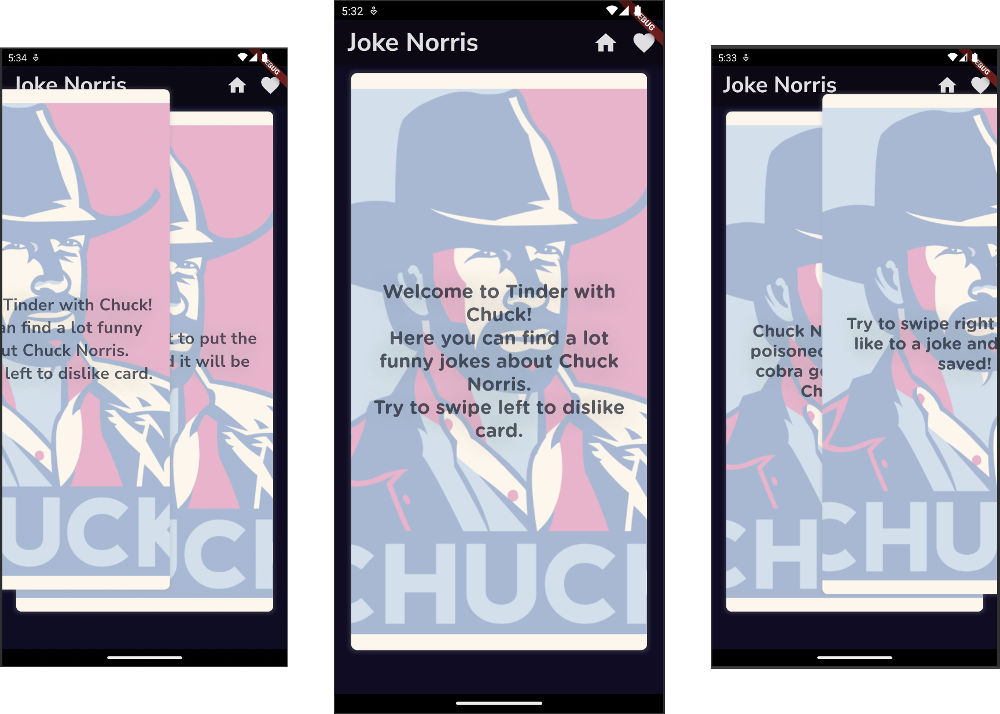
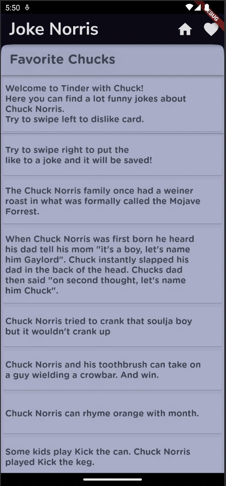
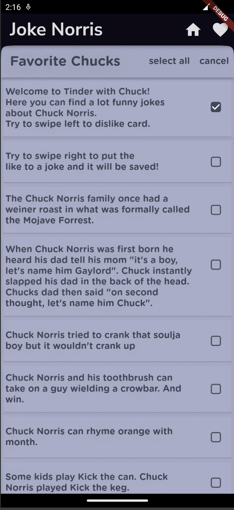

<!-- PROJECT LOGO -->
<div align="center">
  <a href="https://github.com/Amina19058/Tinder_with_Chuck">
    
  </a>

<h1>Tinder with Chuck</h1>

<p>Hi. Welcome to my first Flutter project page!</p>

<p>It is an android app that will make you smile (at least, I hope so).</p>

<p>So let's start our introductory tour of the app!</p>
</div>

<!-- TABLE OF CONTENTS -->
## Table of Contents

- [About the project](#about-the-project)
- [Icon](#icon)
- [Home](#home)
- [Favorites](#favorites)
- [Built With](#built-with)
- [Getting Started](#getting-started)
- [Contact](#contact)

## About the project

Tinder with Chuck Norris is an android app where the user can read jokes about Chuck Norris from [this site](https://api.chucknorris.io). The app has two screens: Home and Favorites. But I suggest we start with the welcoming app icon.

## Icon

The app icon was prepared with [Figma](https://www.figma.com) in three variants. Having overcome meal choice, I decided on the left one.


To add the icon I followed [this tutorial](https://pub.dev/packages/flutter_launcher_icons).

## Home

The home page displays the jokes parsed in random order.
The app has a swipe feature. So here, just like in Tender, you are able to like/dislike the jokes - swipe to the right or to the left respectively.

By swiping to the right jokes are saved for further display on the Favorite screen.



## Favorites

On the Favorites page, you can find your favorite jokes displayed in a list. This list can be scrolled, so don't worry, all your jokes will be saved.



You can also click on each item in the list with a simple or long press. With a long press, checkboxes will appear to the right of all the jokes in the list, and you can also click on them.



I will use this functionality a little later to add the ability to delete the jokes and to see the full version of them.

## Built With

[![Flutter][Flutter]][Flutter-url] [![Dart][Dart]][Dart-url]

<!-- GETTING STARTED -->
## Getting Started

To get a local copy up and running follow these simple example steps.

1. Clone the repo:

   ```sh
   git clone https://github.com/Amina19058/Tinder_with_Chuck.git
   ```

2. Open with Android Studio

3. Run the `main.dart` file

To open the app on android, download `.apk` file from [here](https://drive.google.com/drive/folders/12eYX9sIZ8QGf0-a7jS9-PdobhWQ7-0S_).

## Contact

Telegram - [@amina109](https://t.me/amina109)

email address - [a.khusnutdinova@innopolis.university](a.khusnutdinova@innopolis.university)

<!-- MARKDOWN LINKS & IMAGES -->
[Flutter]: https://img.shields.io/badge/Flutter-0769AD?style=for-the-badge&logo=flutter&logoColor=white
[Flutter-url]: https://flutter.dev

[Dart]: https://img.shields.io/badge/Dart-20232A?style=for-the-badge&logo=dart&logoColor=61DAFB
[Dart-url]: https://dart.dev
